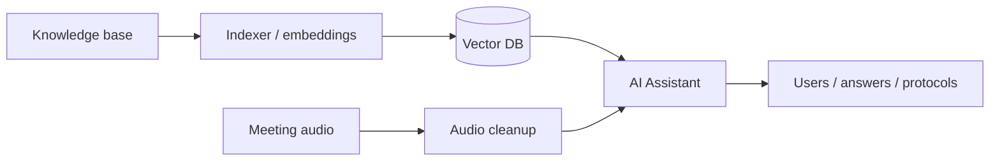
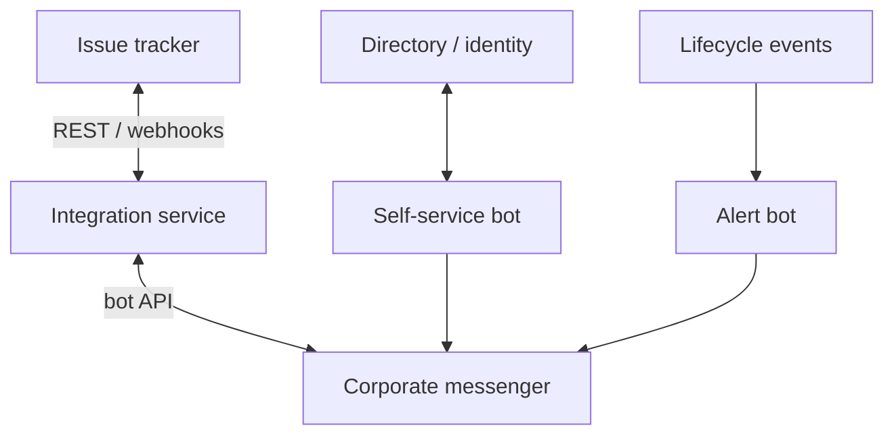

# Portfolio · Artem Tyukin

Public case studies without source code and without corporate secrets.

**Profile:** [github.com/artyom-ai-dev](https://github.com/artyom-ai-dev)  
**Contact:** [tyukin69@bk.ru](mailto:tyukin69@bk.ru) · Yekaterinburg · hybrid / remote · open to work

> Артём Тюкин — fullstack / Python-инженер. Публично здесь только кейсы и схемы; прод-код в приватных репозиториях, разбор — на собеседовании.

---

## Cases

| # | Case | Type | Stack signals |
|---|------|------|---------------|
| 01 | [AI platform: RAG, agents, meetings](cases/01-ai-platform.md) | AI | FastAPI · LangChain · Qdrant · LLM · STT |
| 02 | [Messenger ↔ issue tracker sync](cases/02-messenger-tracker-sync.md) | Integrations | FastAPI · webhooks · REST · Docker |
| 03 | [Identity self-service bot](cases/03-identity-self-service.md) | Automation | Flask · LDAP/LDAPS · webhooks |
| 04 | [Internal web + Excel automation](cases/04-excel-web-automation.md) | Fullstack / data | Flask · LDAP · pandas · openpyxl |

---

## AI contour

## Integrations contour

---

## What this portfolio shows

- End-to-end ownership: problem → service → Docker → users
- AI used where it changes a real process (knowledge search, meetings), not as a demo
- Integration work at system boundaries: trackers, messengers, directory, spreadsheets

## Notes

- Descriptions and diagrams only.
- Production source code stays in private repositories; available on request in interviews.
- No passwords, tokens, internal URLs, IPs, or live configs.

## Stack

`Python` · `FastAPI` · `Flask` · `Docker` · `REST/webhooks` · `LangChain` · `Qdrant` · `LLM` · `PyTorch` · `LDAP` · `pandas` · `openpyxl`
