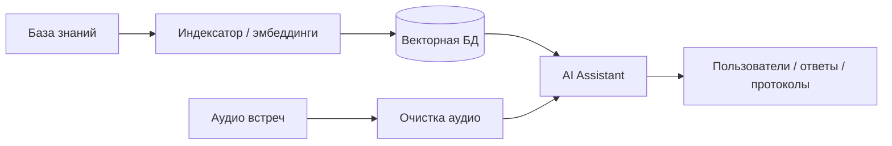
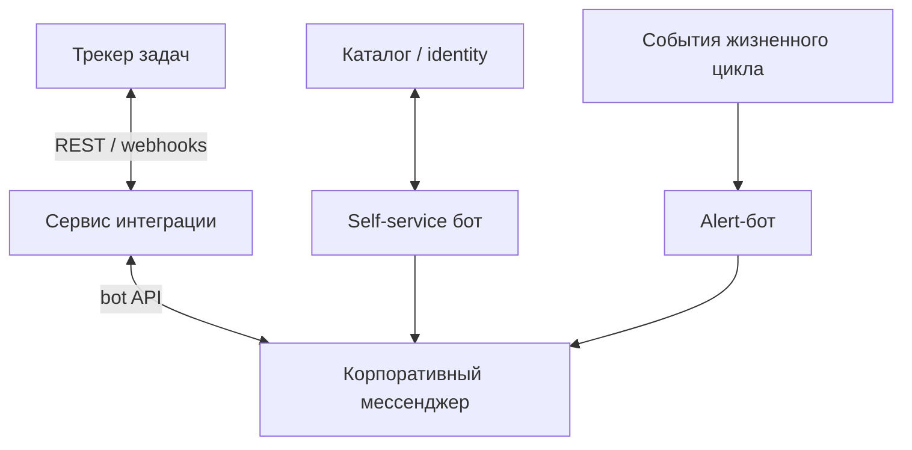

# Портфолио · Артём Тюкин

Публичные кейсы без исходников и без корпоративных секретов.

**Профиль:** [github.com/artyom-ai-dev](https://github.com/artyom-ai-dev)  
**Контакт:** [tyukin69@bk.ru](mailto:tyukin69@bk.ru) · гибрид / удалёнка · открыт к предложениям

> Артём Тюкин — fullstack / Python-инженер. Здесь только кейсы и схемы; прод-код в приватных репозиториях, разбор — на собеседовании.

---

## Кейсы

| # | Кейс | Тип | Стек |
|---|------|------|------|
| 01 | [AI-платформа: RAG, агенты, встречи](cases/01-ai-platform.md) | AI | FastAPI · LangChain · Qdrant · LLM · STT |
| 02 | [Синхронизация мессенджер ↔ трекер](cases/02-messenger-tracker-sync.md) | Интеграции | FastAPI · webhooks · REST · Docker |
| 03 | [Self-service бот по учёткам](cases/03-identity-self-service.md) | Автоматизация | Flask · LDAP/LDAPS · webhooks |
| 04 | [Внутренний веб + Excel-автоматизация](cases/04-excel-web-automation.md) | Fullstack / данные | Flask · LDAP · pandas · openpyxl |

---

## AI-контур

## Контур интеграций

---

## Что показывает это портфолио

- Полный цикл: проблема → сервис → Docker → пользователи
- AI там, где меняет реальный процесс (поиск по знаниям, встречи), а не как демо
- Интеграции на границах систем: трекеры, мессенджеры, каталог, таблицы

## Примечания

- Только описания и схемы.
- Прод-код остаётся в приватных репозиториях; доступ — по запросу на собеседовании.
- Без паролей, токенов, внутренних URL, IP и боевых конфигов.

## Стек

`Python` · `FastAPI` · `Flask` · `Docker` · `REST/webhooks` · `LangChain` · `Qdrant` · `LLM` · `PyTorch` · `LDAP` · `pandas` · `openpyxl`
