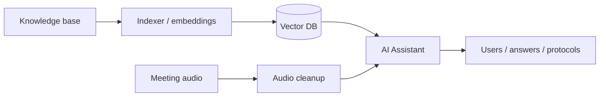
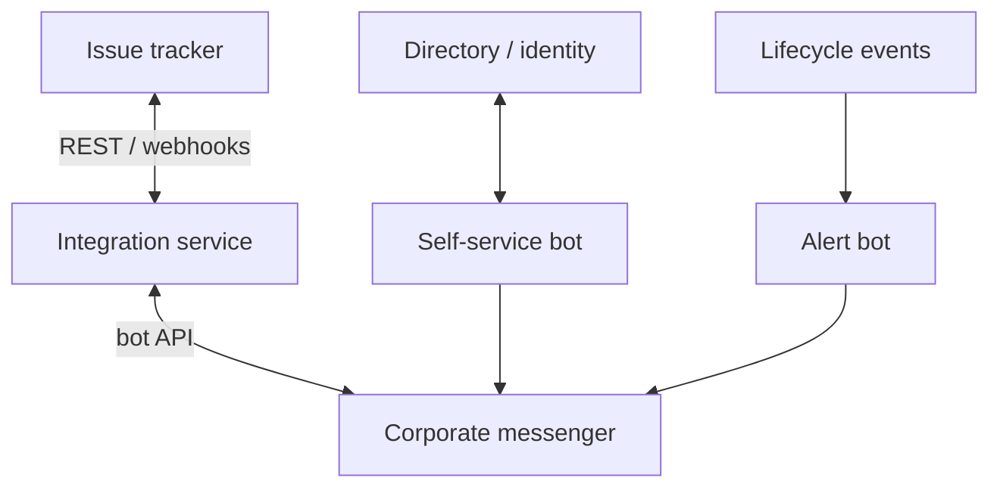

# Portfolio · Artem Tyukin

Публичные разборы кейсов без исходников и без корпоративных секретов.

**Профиль:** [github.com/artyom-ai-dev](https://github.com/artyom-ai-dev)  
**Контакт:** tyukin69@bk.ru

---

## Кейсы

| # | Кейс | Тип |
|---|------|-----|
| 01 | [AI platform: RAG, agents, meetings](cases/01-ai-assistant-rag.md) | AI |
| 02 | [Messenger ↔ issue tracker sync](cases/02-jira-express-sync.md) | Integrations |
| 03 | [Identity self-service bot](cases/03-pass-bot-ldap.md) | Automation |
| 04 | [Internal web + Excel automation](cases/04-excel-web-automation.md) | Fullstack / data |

---

## AI contour

## Integrations contour

---

## Notes

- Здесь только описания и схемы.
- Код рабочих систем — в private-репозиториях, покажу на собеседовании.
- Нет паролей, токенов, внутренних URL, IP и боевых конфигов.

## Stack

`Python` · `FastAPI` · `Flask` · `Docker` · `REST/webhooks` · `LangChain` · `Qdrant` · `LLM` · `PyTorch` · `LDAP` · `pandas` · `openpyxl`
