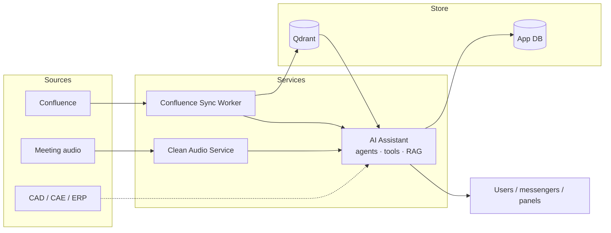
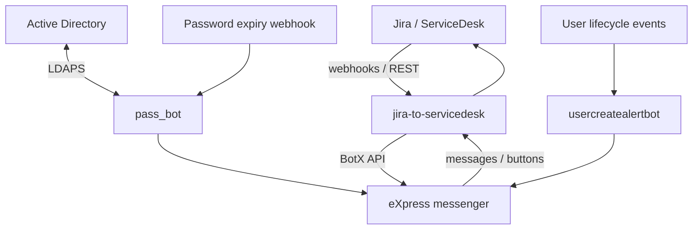

# Portfolio · Artem Tyukin

Публичная витрина кейсов. Исходники рабочих систем остаются в **private** репозиториях — здесь описания, схемы и стек без корпоративных секретов.

**Профиль:** [github.com/artyom-ai-dev](https://github.com/artyom-ai-dev)  
**Контакт:** tyukin69@bk.ru · +7 (982) 690-26-23

---

## Кейсы

| # | Кейс | Тип | Стек |
|---|------|-----|------|
| 01 | [AI Assistant + RAG + meeting pipeline](cases/01-ai-assistant-rag.md) | AI platform | FastAPI, LangChain, Qdrant, Ollama/GigaChat |
| 02 | [Jira ↔ Express sync](cases/02-jira-express-sync.md) | Integration | FastAPI, webhooks, Jira REST, BotX |
| 03 | [AD password self-service bot](cases/03-pass-bot-ldap.md) | Automation | Flask, LDAP/LDAPS, webhooks |
| 04 | [Excel / internal web automation](cases/04-excel-web-automation.md) | Fullstack + data | Flask, pandas, openpyxl, LDAP |

---

## Карта AI-контура

## Карта интеграций

---

## Как смотреть

1. Открой кейс из таблицы  
2. Если интересна реализация — напиши, покажу private-репозитории на собеседовании  
3. Секреты, внутренние URL и боевые конфиги сюда не попадают

---

## Стек (коротко)

`Python` · `FastAPI` · `Flask` · `Docker` · `REST/webhooks` · `LangChain` · `Qdrant` · `LLM` · `PyTorch` · `LDAP` · `Jira` · `pandas/openpyxl`
