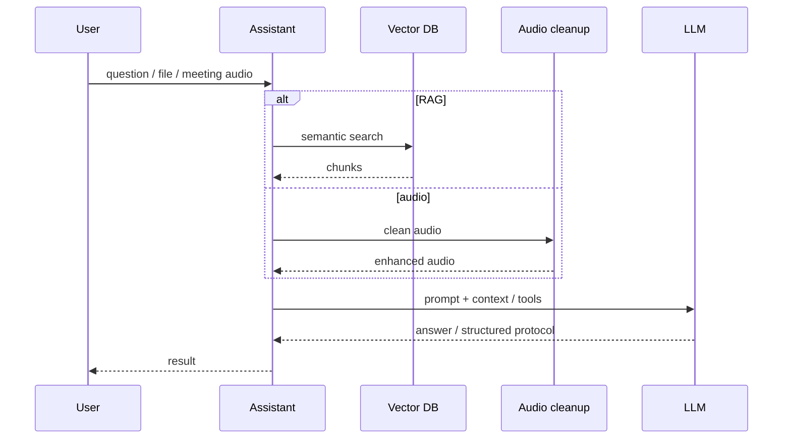

# 01 · AI platform: RAG, agents, meetings

## Problem
Need a corporate AI contour: answers over internal knowledge, agents with tools, meeting processing (audio → text → protocol), with respect to data-handling constraints.

## What I built
- Multi-agent backend on FastAPI: routing, tool-calling, document collections, meeting summarization
- Knowledge indexer: source pages → cleanup → chunking → embeddings → vector DB
- Audio cleanup microservice for speech enhancement before STT
- End-to-end meeting flow: recording segments → cleanup → transcription → protocol

## Flow

## Stack
Python, FastAPI, LangChain, Qdrant, embeddings/TEI, Ollama/GigaChat, PyTorch, Docker

## Outcome
Production services in an enterprise contour: knowledge search via RAG, meeting protocols through an audio pipeline, containerized deploy and ownership of the stack.
