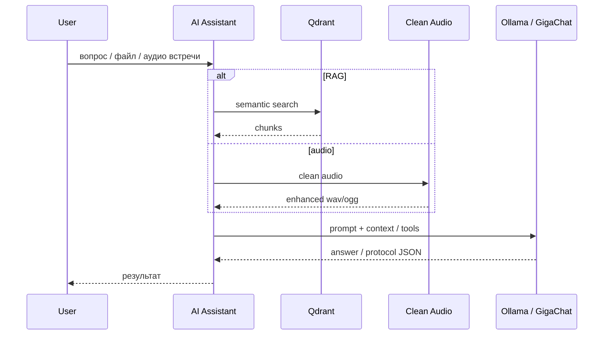

# 01 · AI Assistant + RAG + meeting pipeline

## Задача
Собрать корпоративный AI-контур: ответы по базе знаний, агенты с инструментами, обработка встреч (аудио → текст → протокол) без утечки чувствительных данных во внешние SaaS там, где это запрещено политикой.

## Что сделал
- Мультиагентский бэкенд **AI Assistant** (FastAPI): роутинг агентов, tool-calling, коллекции документов, суммаризация встреч
- **Confluence Sync Worker**: инкрементальная индексация Confluence → очистка HTML → чанкинг → эмбеддинги (TEI / multilingual-e5) → **Qdrant**
- **Clean Audio Service**: очистка речи DeepFilterNet3 + ffmpeg как отдельный микросервис
- Связка с контуром записи встреч (**Peregovornaya**): сегменты → очистка → STT → протокол

## Архитектура

## Стек
Python, FastAPI, LangChain, Qdrant, TEI embeddings, Ollama, GigaChat, PyTorch, Docker

## Результат
Рабочий production-контур: знания из Confluence доступны агенту, встречи проходят через очистку и суммаризацию, сервисы деплоятся контейнерами и сопровождаются внутри контура предприятия.

## Репозитории
Private: `ai-assistant`, `confluence-sync-worker`, `clean-audio-service` (+ участие в `Peregovornaya`)
