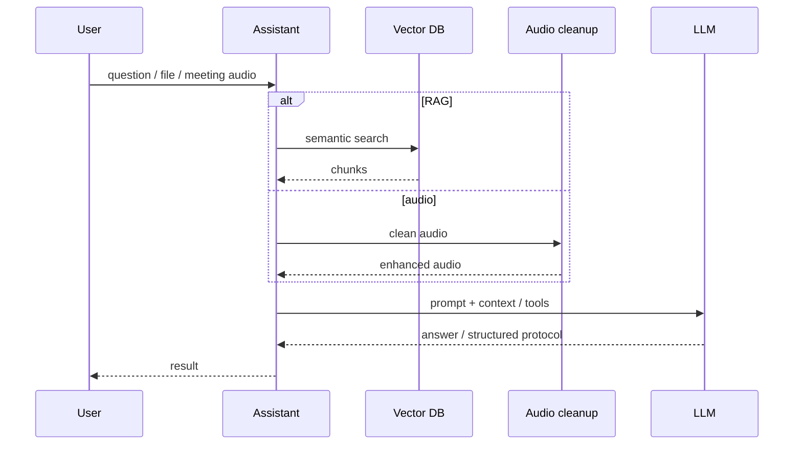

# 01 · AI platform: RAG, agents, meetings

## Problem
Need a corporate AI contour: answers over internal knowledge, agents with tools, meeting processing (audio → text → protocol), with respect to data-handling constraints.

## Role
Software engineer / developer — design, backend, Docker packaging, integrations, ongoing ownership in production.

## What I built
- Multi-agent backend on FastAPI: routing, tool-calling, document collections, meeting summarization
- Knowledge indexer: source pages → cleanup → chunking → embeddings → vector DB
- Audio cleanup microservice for speech enhancement before STT
- End-to-end meeting flow: recording segments → cleanup → transcription → protocol

## Constraints
- Sensitive corporate data — prefer local / corporate LLM where policy requires
- Must plug into existing knowledge sources and meeting recording path
- Services must be containerized and operable by the team

## Flow

## Stack
Python, FastAPI, LangChain, Qdrant, embeddings/TEI (`multilingual-e5-large`), Ollama/GigaChat, PyTorch (DeepFilterNet3), ffmpeg, Docker

## Related private repos
`ai-assistant` · `confluence-sync-worker` · `clean-audio-service` · contribution to `Peregovornaya` (meeting recorder)

## Outcome
Production services in an enterprise contour: knowledge search via RAG, meeting protocols through an audio pipeline, containerized deploy and ownership of the stack.
