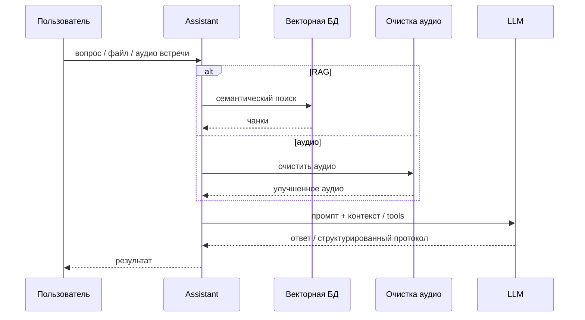

# 01 · AI-платформа: RAG, агенты, встречи

## Проблема
Нужен корпоративный AI-контур: ответы по внутренней базе знаний, агенты с tools, обработка встреч (аудио → текст → протокол) с учётом ограничений по данным.

## Роль
Инженер-программист / разработчик — проектирование, бэкенд, Docker, интеграции, сопровождение в проде.

## Что сделал
- Мультиагентский бэкенд на FastAPI: роутинг, tool-calling, коллекции документов, суммаризация встреч
- Индексатор знаний: страницы → очистка → чанкинг → эмбеддинги → векторная БД
- Микросервис очистки речи перед STT
- Сквозной поток встреч: сегменты записи → очистка → транскрибация → протокол

## Ограничения
- Чувствительные корпоративные данные — локальные / корпоративные LLM, где требует политика
- Нужно встраиваться в существующие источники знаний и путь записи встреч
- Сервисы должны быть в контейнерах и обслуживаемыми командой

## Поток

## Стек
Python, FastAPI, LangChain, Qdrant, эмбеддинги/TEI (`multilingual-e5-large`), Ollama/GigaChat, PyTorch (DeepFilterNet3), ffmpeg, Docker

## Связанные приватные репо
`ai-assistant` · `confluence-sync-worker` · `clean-audio-service` · участие в `Peregovornaya` (запись встреч)

## Результат
Прод-сервисы в корпоративном контуре: поиск по знаниям через RAG, протоколы встреч через аудио-пайплайн, контейнерный деплой и владение стеком.
