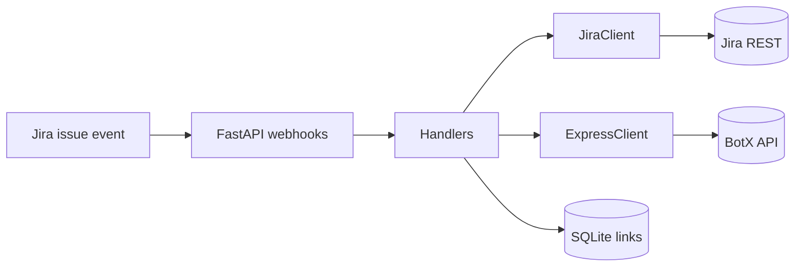

# 02 · Jira ↔ Express sync

## Задача
Связать Jira и корпоративный мессенджер Express так, чтобы заявки жили в чатах: комментарии, файлы, статусы, оценка качества — без ручного копирования.

## Что сделал
Сервис **jira-to-servicedesk** на FastAPI:
- webhooks из Jira и Express
- автосоздание групповых чатов по задачам
- двусторонняя синхронизация комментариев и вложений
- уведомления о статусах, CSAT, переоткрытие, эпики, ВКС-вебхуки
- SQLite для связей чат ↔ задача, админ-команды, Docker/CI

## Поток

## Стек
Python, FastAPI, httpx/requests, webhooks, Jira REST, Express BotX, SQLite, Docker

## Результат
Заявки сопровождаются в мессенджере end-to-end: меньше ручной рутины у поддержки, история и файлы не теряются между системами.

## Репозиторий
Private: `jira-to-servicedesk`  
Смежные: `bot_jira` (SLA-дайджесты в каналы)
