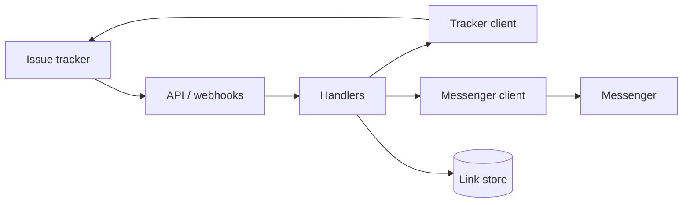

# 02 · Messenger ↔ issue tracker sync

## Problem
Support work was split between an issue tracker and a corporate messenger. Comments, files, and status updates were copied manually.

## Role
Backend / integration engineer — service design, webhooks, persistence, Docker packaging.

## What I built
Integration service on FastAPI:
- inbound/outbound webhooks
- auto-created chats linked to issues
- two-way sync of comments and attachments
- status notifications and a simple CSAT flow
- persistence for chat↔issue links, admin commands, Docker packaging

Related: channel digests for SLA / ServiceDesk queues (`bot_jira`).

## Constraints
- Two systems of record with different event models
- Attachments and comments must not get lost in either direction
- Must survive webhook retries and partial failures

## Flow

## Stack
Python, FastAPI, REST, webhooks, SQLite, Docker

## Related private repos
`jira-to-servicedesk` · `bot_jira`

## Outcome
Issues can be handled in messenger end-to-end with less manual copying and fewer lost attachments/comments.
