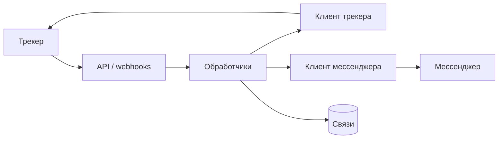

  

# 02 · Синхронизация мессенджер ↔ трекер

## Проблема
Поддержка была разнесена между трекером задач и корпоративным мессенджером. Комментарии, файлы и статусы копировали вручную.

## Роль
Backend / integration-инженер — дизайн сервиса, webhooks, персистентность, Docker.

## Что сделал
Сервис интеграции на FastAPI:
- входящие / исходящие webhooks
- автосоздание чатов, привязанных к задачам
- двусторонняя синхронизация комментариев и вложений
- уведомления о статусах и простой CSAT-флоу
- хранение связей чат↔задача, админ-команды, упаковка в Docker

Связанно: дайджесты SLA / очередей ServiceDesk в каналы (`bot_jira`).

## Ограничения
- Две системы учёта с разными моделями событий
- Вложения и комментарии не должны теряться ни в одну сторону
- Устойчивость к повторным webhook и частичным сбоям

## Поток

## Стек
Python, FastAPI, REST, webhooks, SQLite, Docker

## Связанные приватные репо
`jira-to-servicedesk` · `bot_jira`

## Результат
Задачи можно вести в мессенджере end-to-end: меньше ручного копирования и потерь вложений/комментариев.
