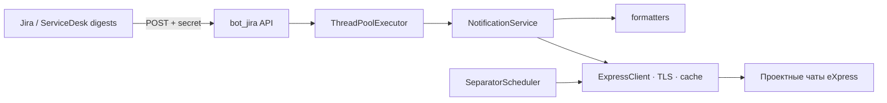
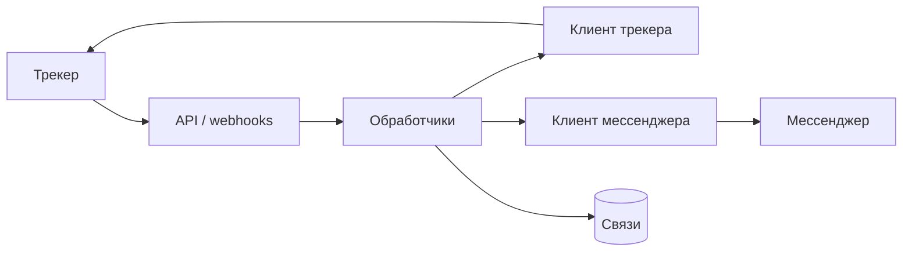

  

# 02 · Синхронизация мессенджер ↔ трекер

## Проблема
Поддержка была разнесена между трекером задач и корпоративным мессенджером. Комментарии, файлы и статусы копировали вручную; SLA-дайджесты не доходили до нужных каналов вовремя.

## Роль
Backend / integration-инженер — дизайн сервисов, webhooks, персистентность, Docker, архитектура notification gateway.

## Что сделал

**jira-to-servicedesk** — двусторонний мост трекер ↔ мессенджер:
- входящие / исходящие webhooks
- автосоздание чатов, привязанных к задачам
- синхронизация комментариев и вложений
- статусы, CSAT, админ-команды, Docker

**bot_jira** — notification gateway для SLA/дайджестов:
- `POST /jira` и `POST /servicedesk` → рассылка в проектные чаты
- маршрутизация по префиксу issue key, fan-out в канал руководителей
- daily separators в будни
- слои `api` / `domain/formatting` / `NotificationService` / `ExpressClient`
- auth на webhook, TLS к BotX, ограниченный пул потоков вместо unbounded threads
- gunicorn в проде

## Архитектура дайджестов

## Ограничения
- Две системы учёта с разными моделями событий
- Вложения и комментарии не должны теряться ни в одну сторону
- Устойчивость к повторным webhook и частичным сбоям
- Дайджесты не должны утекать без auth и не раскрывать watch-list в публичных GET

## Поток синхронизации

## Стек
Python, FastAPI, Flask, gunicorn, REST, webhooks, BotX/eXpress, SQLite, Docker

## Связанные приватные репо
`jira-to-servicedesk` · `bot_jira`

## Результат
Задачи можно вести в мессенджере end-to-end. SLA-дайджесты и разделители приходят в нужные каналы по расписанию и правилам маршрутизации — без ручного копирования.
