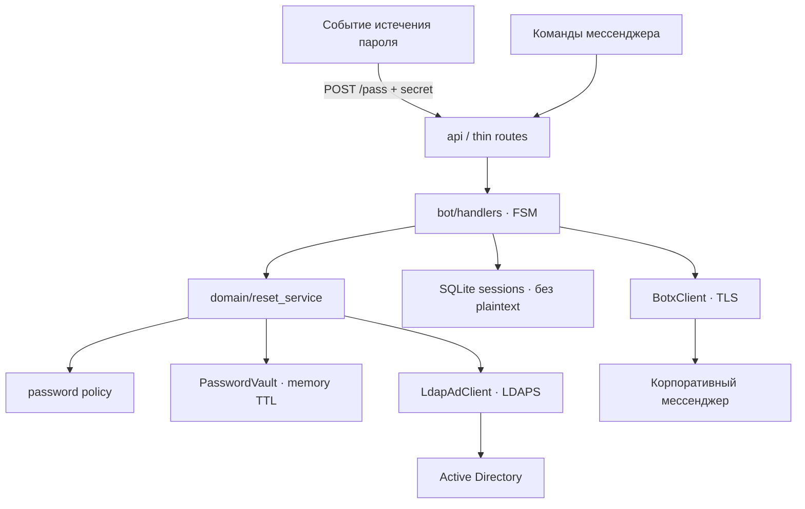

<div align="center">
  
</div>

# 03 · Self-service бот по учёткам


## Проблема
Истекшие пароли в каталоге порождали однотипные заявки в поддержку. Нужен guided self-service прямо в корпоративном мессенджере — без ручной смены пароля админом и без хранения секретов «как попало».


## Роль
Backend / automation-инженер — conversational-бот + webhook-сервис, интеграция с каталогом, FSM, audit trail, hardening security.


## Что сделал

**pass_bot** — self-service смена просроченного пароля в мессенджере:
- webhook о истечении → чат → пошаговый FSM (логин → требования → верификация → пароль)
- политика пароля до записи в каталог
- синхронный LDAPS-modify; успех пользователю только после ответа AD
- пароль не пишется в SQLite — только short-TTL vault в памяти
- экранирование LDAP-фильтров, rate-limit верификации, auth на inbound webhook
- слои: `api` → `handlers/FSM` → `domain` → `adapters` (BotX / LDAP / persistence)
- прод-запуск через gunicorn

**usercreatealertbot** — alert-релей жизненного цикла учёток (1С/AD → HR-чат):
- парсинг событий ADD / UVOL / MOD / …
- защищённый webhook, TLS к BotX, без публичного dump PII
- пайплайн `format → notify`, отделённый от HTTP


## Архитектура




## Ограничения
- Защищённое подключение к каталогу (LDAPS)
- Политика пароля проверяется локально и финально политикой AD
- Секреты только из env, fail-fast при старте
- Аудит смены — без хранения пароля
- Test-эндпоинты выключены в проде


## Поток

```text
Событие истечения
  → сообщение бота в мессенджере
  → верификация пользователя
  → новый пароль + проверки политики
  → синхронное обновление в каталоге
  → подтверждение только при LDAP success
```


## Стек
Python, Flask, gunicorn, LDAP/LDAPS, BotX/eXpress, webhooks, SQLite, Docker


## Связанные приватные репо
`pass_bot` · `usercreatealertbot`


## Результат
Типовые кейсы «пароль истёк» ушли в self-service. Контур алертов по приёму/увольнению/изменениям доставляет читаемые карточки в чат без ручного копирования из логов AD.
